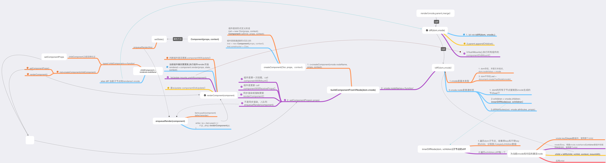

##  1 模板编译

  ### 需求 : 使用 render 函数 让 被解析后的jsx 与 dom 绑定
  我们先来一个render函数:
  
```js
function render(jsx, domMounter) {
     let builtDOM = domBuilder(jsx);
        domMounter.appendChild(builtDOM);
    return builtDOM;
}
```
熟悉react的同学都知道 , 我们向render函数传入的两个参数就是 被解析后的jsx 与 dom 挂载点

实际上 被解析后的jsx就是对我们后面定义的h函数的递归调用

在 render 函数中 我们主要调用了 domBuilder 函数


```js
function domBuilder(vNode) {
    if (typeof vNode === 'string' || typeof vNode === 'number') {
        return document.createTextNode(vNode);
    }
    let { nodeName, attributes: attrs, children } = vNode;
    if (typeof nodeName === 'string') {
        let node = document.createElement(nodeName);
        if (attrs) {
            for (let key in attrs) {
                if (!attrs.hasOwnProperty(key)) continue;  // todo 使用 object.create(null) 以省略此句
                 node.setAttribute(key, attrs[key]); // 设置 dom 节点的属性
            }
        }
        // 递归调用
        if (children) {
            children.forEach(childVNode => {
                let subNode = domBuilder(childVNode);
                node.appendChild(subNode);
            });
        }
        return node;
    }
}
```

我们看到 domBuilder 主要是进行 vNode 的处理, 这里我们需要了解vNode的构造

```js
class VNode {
    constructor(nodeName, attributes, children) {
        this.nodeName = nodeName;
        this.attributes = attributes;
        this.children = children;
    }
}

declare type VNode<P> = {
    nodeName: string | Function,
    children: Array<VNode<P>,
    attributes: P,
    //key?: string | number | void,   //   为了diff的优化 这里可以先不用
};

```

其中的children,是其他的子孙vNode,其实vNode是一个树型的结构,他是为了描述dom结构,dom我们都知道他是树形的.


通过 webpack 编译 jsx 调用自己编写的 h 函数 返回 vNode ,为什么叫做 h 函数呢,这是约定俗成的.

```js
function h(nodeName, attributes, ...args) {
  //对children进行处理 ,把args放到数组里封装成children
    let children = args.length ? [].concat(...args) : null;
    return new VNode(nodeName, attributes, children);
}

```
 
 有了这些函数以后  我们就能执行最基本的功能,即通过编写 jsx 生成真实dom并挂载到网页上.


## 2 组件编译 

这里我们新建一个组件类 

```js
class Component {
    constructor() {
        this.props = {};
        this.nextProps = {};
        this.state = {};
    }

    setState(state) {
        extend(this.state, state);
        cRender(this);
    }

    render(props) {
        return h('div', null, props.children);
    }

    // shouldComponentUpdate(props, state) {
    //     return true;
    // }
}

//------------------------------------------

function extend(obj, props) {
    for (let key in props) {
        if (props.hasOwnProperty(key)) {
            obj[key] = props[key];
        }
    }
    return obj;
}
```

加上 component 以后, 就要考虑 domBuilder 函数在处理 component 时的情况

```diff
+   function domBuilder(vNode,dom) {
        if (typeof vNode === 'string'|| typeof vNode === 'number') {
            return document.createTextNode(vNode);
        }
        let { nodeName, attributes: attrs, children } = vNode;

+       if (typeof nodeName === 'function') {
+            return cDomBuilder(vNode, dom);
+        }
......

```

在这里  我们判断如果node为component,执行另外一个方法 cDomBuilder

可以看到代码上 判断 typeof nodeName === 'function', 即可知道node为component,  
这是因为bable解析jsx时 组件的nodeName传的是组件类 

```javascript
function cDomBuilder(vNode, dom) {
    if (dom && dom._component) {
        setComponentProps(dom._component, getNodeProps(vNode)); // 组件的props 相当于 普通标签的attrs
        cRender(dom._component); //  在设置 props 之后重新渲染组件
    } else {
        dom = createComponentFromVNode(vNode);
    }
    return dom;
}

function getNodeProps(vNode) {
    return {...vNode.attributes};
}

/**
 * 由 vNode 生成 base 真实 DOM；
 * 注意与 buildComponentFromVNode 的区别
 * @param vNode
 * @returns {DOM|*}
 */
function createComponentFromVNode(vNode) {
    let component = new vNode.nodeName();
    let props = getNodeProps(vNode);
    setComponentProps(component, props);
    cRender(component);
    return component.base;
}

```

这个函数实际上执行了另外两个方法 


```js
/**
 * 把最新的 props 覆盖 nextProps
 * @param {Component} component 组件
 * @param {Object} props 新的props
 */
function setComponentProps(component, props) {
    // hook(component, 'componentWillReceiveProps', props, component.props)

    component.nextProps = props;
}


/**
 * 组件渲染主体逻辑
 * ① 生成新的 vNode → renderedVNode
 * ② 构建出新的 DOM → base
 * ③ 挂载到 base 上
 * nextProps setState之后的值
 * props setState之前的值
 * @param {Component} component 组件
 */
function cRender(component) {
    let p = component.nextProps;
    let s = component.state;
    if (component.base) {  // 非首次渲染
        执行一些优化操作
    }
    // component.props = p;
    let renderedVNode = hook(component, 'render', p, s); // 执行组件内部钩子函数
    let base = domBuilder(renderedVNode, component.base);
    if (base) {
        component.base = base;
        component.base._component = component;
    }
    return base;
}
```


在这里需要说明一下说明一下 hook 函数  

```js
function hook(obj, name, ...args) {
    let fn = obj[name];
    if (fn && typeof fn === 'function') {
        console.log('即将执行'+name+'函数')
        return fn.apply(obj, args); // 通过apply改变fn的this指针的指向为obj,并为fn传入args参数
    } else {
        console.error('生命周期函数'+name+'不存在')
    }
}
```

我们通过hook函数调用了component里的render函数  实际上,以后我们会不断调用hook函数来执行组件的生命周期函数

## 整体代码

```js
class VNode {
    constructor(nodeName, attributes, children) {
        this.nodeName = nodeName;
        this.attributes = attributes;
        this.children = children;
    }
}

class Component {
    constructor() {
        this.props = {};
        this.nextProps = {};
        this.state = {};
    }
    setState(state) {
        extend(this.state, state);
        cRender(this);
    }
    render(props) {
        return h('div', null, props.children);
    }
}

function render(vNode, parent) {
    let builtDOM = domBuilder(vNode);
    parent.appendChild(builtDOM);
    return builtDOM;
}

function domBuilder(vNode, dom) {
    // ①文本节点
    if (typeof vNode === 'string' || typeof vNode === 'number') {
        return document.createTextNode(vNode);
    }
    let {nodeName, attributes: attrs, children: vChildren} = vNode;

    // ②组件节点
    if (typeof nodeName === 'function') {
        return cDomBuilder(vNode, dom);
    }

    // ③普通 Element 节点
    let out = dom;  // out 是挂载新 dom 的最外层节点，必不可少
    if (typeof nodeName === 'string'  ) {
        if (!dom) {
            out = document.createElement(nodeName);
        }
        let children;
        if (out && out.childNodes) {
            children = Array.from(out.childNodes);  // 获取旧 dom 的子节点集合
        }

        // 处理节点的属性（包括事件绑定）
        if (attrs) {
            for (let key in attrs) {
                if (!attrs.hasOwnProperty(key)) continue;
                setAttributes(out, key, attrs[key]);
            }
        }

        // 遍历 vNode.children，逐个地递归调用 domBuilder 函数，生成新 DOM
        let newChildren = [];
        if (vChildren && vChildren.length) {
            vChildren.forEach((vchild, i) => {
                let child = children[i];
                newChildren.push(domBuilder(vchild, child));
            });
        }

        // 首次渲染适用于这里的情况
        newChildren.forEach((newChild, i) => {
            if (children[i] !== newChild) {
                out.appendChild(newChild);
            }
        });
    }
    return out;
}


function cDomBuilder(vNode, dom) {
    if (dom && dom._component) {
        console.log('dom._component',dom._component)

        setComponentProps(dom._component, getNodeProps(vNode));
        cRender(dom._component); /* 在设置 props 之后重新渲染组件 */
    } else {
        dom = createComponentFromVNode(vNode);
    }
    return dom;
}


function createComponentFromVNode(vNode) {
    let component = new vNode.nodeName();
    let props = getNodeProps(vNode);
    setComponentProps(component, props);
    c       Render(component);
    /7/84*return component.base;pp                     
}


function cRender(component) {
    let p = component.nextProps;
    let s = component.state;
    let rendered = hook(component, 'render', p, s);
    let base = domBuilder(rendered, component.base);

    if (base) {
        component.base = base;
        component.base._component = component;
    }

    return base;
}


function setComponentProps(component, props) {
    component.nextProps = props;
}

function h(nodeName, attributes, ...args) {
    let children = args.length ? [].concat(...args) : null;
    return new VNode(nodeName, attributes, children);
}

function getNodeProps(vNode) {
    return {...vNode.attributes};
}

function hook(obj, name, ...args) {
    let fn = obj[name];
    if (fn && typeof fn === 'function') {
        console.log('即将执行'+name+'函数')
        return fn.apply(obj, args); // 通过apply改变fn的this指针的指向为obj,并为fn传入args参数
    } else {
        console.error('生命周期函数'+name+'不存在')
    }
}

function setAttributes(node, attr, value) {
    node.setAttribute(attr, value);
}

function extend(obj, props) {
    for (let key in props) {
        if (props.hasOwnProperty(key)) {
            obj[key] = props[key];
        }
    }
    return obj;
}

export default {
    render,
    h,
    Component
}
```


这些让我们可以生成一个mvc开发框架 ,但是它有一个问题,就是我们改变dom时不能动态的去diff,只能生成新的dom去暴力覆盖旧的dom,这在性能上是极大的浪费.所以 我们下一步就是要去添加diff算法.

## diff

 我们知道直接操作dom是很消耗性能的 ,下一步我们需要考虑如何对其进行优化. 业界的通常做法是使用js对抽象出dom的结构 , 即vNode, 并在内存中比对前后生成的vNode, 找到差异, 只对差异的部分进行更新,我们也可以成这个过程为patching.

diff过程中会对新旧虚拟节点和新旧props做比较，然后渲染出真实的dom。

因为实际的diff代码很长,所以我们用伪码来表示其中的逻辑 


```js
function diff(parentDom, newVNode, oldVNode) {
    // 非虚拟组建  直接返回
    if (newVNode.constructor !== undefined) return null;

    // 函数式组件
    if (typeof newVNode.type === 'function') {
        //如果已经存在实例化的组件
        if (oldVNode._component) {
            c = newVNode._component = oldVNode._component;
        } else {
            // 实例化组件
            if ('prototype' in newType && newType.prototype.render) {
                //类组件的话  去实例化
                newVNode._component = c = new newType(newProps, cctx);
            } else {

                //函数组件的话会实例化Component
                newVNode._component = c = new Component(newProps, cctx);
                
                //设置render
                c.render = c.constructor = newType;

            }
            //订阅，当provider组件value改变时，渲染组件
            if (provider) provider.sub(c);
            //标记需要渲染并且是新创建的组件
            isNew = c._dirty = true;
            c._renderCallbacks = [];
            //如果nextState为假则赋值state
            if (c._nextState == null) c._nextState = c.state;

            // 有getDerivedStateFromProps执行此生命周期并扩展到_nextState

            // do something about lifeycle

            // 进行 render
            tmp = c.render(c.props, c.state, c.context);

            // 对比子节点
            diffChildren(
                parentDom,
                newVNode,
                oldVNode
            )
            if (c._renderCallbacks.length) commitQueue.push(c);

            //设置强制更新为false
            c._force = null;
        }
    } 
    // 非函数式组件
    else {
        newVNode._dom = diffElementNodes(parentDom, newVNode, oldVNode)
    }
} 
```

这里我们的diff函数主要处理函数型节点，也就是类型为类组件和无状态组件的虚拟节点，如果不是函数类型节点则会调用diffElementNodes函数来处理。先判断虚拟节点是否有_component属性，如果没有则实例化一个组件，然后执行组件的一些生命周期。完成后执行组件的render方法，在执行完render方法后会把返回的虚拟节点保存在虚拟节点的_children属性中，然后调用diffChildren函数来比较子节点，最后diff函数会返回虚拟节点生成的dom。


 


