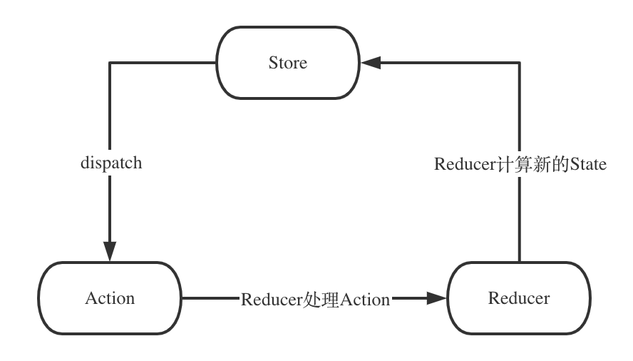

## redux 基本概念

### Store

人如其名，Store就是一个仓库，它存储了所有的状态(State)，还提供了一些操作他的API，我们后续的操作其实都是在操作这个仓库。假如我们的仓库是用来放牛奶的，初始情况下，我们的仓库里面一箱牛奶都没有。那Store的状态(State)就是：

```JS
{
	milk: 0
}
```

### Actions

一个Action就是一个动作，这个动作的目的是更改Store中的某个状态，Store还是上面的那个仓库，现在我想往仓库放一箱牛奶，那"我想往仓库放一箱牛奶"就是一个Action。代码就是这样：
```JS
{
  type: "PUT_MILK",
  count: 1
}
```

### Reducers
前面"我想往仓库放一箱牛奶"只是想了，还没操作，具体操作要靠Reducer，Reducer就是根据接收的Action来改变Store中的状态，比如我接收了一个PUT_MILK，同时数量count是1，那放进去的结果就是milk增加了1，从0变成了1，代码就是这样:
```js
const initState = {
  milk: 0
}

function reducer(state = initState, action) {
  switch (action.type) {
    case 'PUT_MILK':
      return {...state, milk: state.milk + action.count}
    default:
      return state
  }
}
```

可以看到Redux本身就是一个单纯的状态机，Store存放了所有的状态，Action是一个改变状态的通知，Reducer接收到通知就更改Store中对应的状态。


------

## 通过手写redux理解redux


### API：createStore 

这里我们给出一个使用redux的例子 在后面我们替换为自己手写的redux

```js
import { createStore } from 'redux';

const initState = {
  milk: 0
};

function reducer(state = initState, action) {
  switch (action.type) {
    case 'PUT_MILK':
      return {...state, milk: state.milk + action.count};
    case 'TAKE_MILK':
      return {...state, milk: state.milk - action.count};
    default:
      return state;
  }
}

let store = createStore(reducer);

// subscribe其实就是订阅store的变化，一旦store发生了变化，传入的回调函数就会被调用
// 如果是结合页面更新，更新的操作就是在这里执行
store.subscribe(() => console.log(store.getState()));

// 将action发出去要用dispatch
store.dispatch({ type: 'PUT_MILK' });    // milk: 1
store.dispatch({ type: 'PUT_MILK' });    // milk: 2
store.dispatch({ type: 'TAKE_MILK' });   // milk: 1
```
在上文的例子中 我们只用到了一个API

createStore：这个API接受reducer方法作为参数，返回一个store，主要功能都在这个store上。

看看store上我们都用到了啥：

store.subscribe: 订阅state的变化，当state变化的时候执行回调，可以有多个subscribe，里面的回调会依次执行。

store.dispatch: 发出action的方法，每次dispatch action都会执行reducer生成新的state，然后执行subscribe注册的回调。

store.getState:一个简单的方法，返回当前的state。

看到subscribe注册回调，dispatch触发回调. 这就是典型的发布订阅模式.后面聊聊发布订阅模式.

```js
function createStore() {
  let state;              // state记录所有状态
  let listeners = [];     // 保存所有注册的回调

  function subscribe(callback) {
    listeners.push(callback);       // subscribe就是将回调保存下来
  }

  // dispatch就是将所有的回调拿出来依次执行就行

  function dispatch(action) {
    /**
    * reducer的作用是在发布事件的时候改变state，
    * 所以我们的dispatch在执行回调前应该先执行reducer,
    * 用reducer的返回值重新给state赋值
    */
    state = reducer(state, action);
    // 改变状态后执行订阅的callback
    for (let i = 0; i < listeners.length; i++) {
      const listener = listeners[i];
      listener();
    }
  }
  // getState直接返回state
  function getState() {
    return state;
  }

  // store包装一下前面的方法直接返回
  const store = {
    subscribe,
    dispatch,
    getState
  }

  return store;
}
```


### API:combineReducers

combineReducers也是使用非常广泛的API，当我们应用越来越复杂，如果将所有逻辑都写在一个reducer里面，最终这个文件可能会有成千上万行，所以Redux提供了combineReducers，可以让我们为不同的模块写自己的reducer，最终将他们组合起来。比如我们最开始那个牛奶仓库，由于我们的业务发展很好，我们又增加了一个放大米的仓库，我们可以为这两个仓库创建自己的reducer

```js
import { createStore, combineReducers } from 'redux';

const initMilkState = {
  milk: 0
};
function milkReducer(state = initMilkState, action) {
  switch (action.type) {
    case 'PUT_MILK':
      return {...state, milk: state.milk + action.count};
    case 'TAKE_MILK':
      return {...state, milk: state.milk - action.count};
    default:
      return state;
  }
}

const initRiceState = {
  rice: 0
};
function riceReducer(state = initRiceState, action) {
  switch (action.type) {
    case 'PUT_RICE':
      return {...state, rice: state.rice + action.count};
    case 'TAKE_RICE':
      return {...state, rice: state.rice - action.count};
    default:
      return state;
  }
}

// 使用combineReducers组合两个reducer
const reducer = combineReducers({milkState: milkReducer, riceState: riceReducer});

let store = createStore(reducer);

store.subscribe(() => console.log(store.getState()));

// 操作🥛的action
store.dispatch({ type: 'PUT_MILK', count: 1 });    // milk: 1
store.dispatch({ type: 'PUT_MILK', count: 1 });    // milk: 2
store.dispatch({ type: 'TAKE_MILK', count: 1 });   // milk: 1

// 操作大米的action
store.dispatch({ type: 'PUT_RICE', count: 1 });    // rice: 1
store.dispatch({ type: 'PUT_RICE', count: 1 });    // rice: 2
store.dispatch({ type: 'TAKE_RICE', count: 1 });   // rice: 1
```


在上面 我们新建了两个state，通过combineReducers接收这两个reducer并返回一个新的reducer。让我们尝试实现一下：

```js
function combineReducers(reducerMap) {
  const reducerKeys = Object.keys(reducerMap);    // 先把参数里面所有的键值拿出来
  
  // 返回值是一个普通结构的reducer函数
  const reducer = (state = {}, action) => {
    const newState = {};
    
    for(let i = 0; i < reducerKeys.length; i++) {
      // reducerMap里面每个键的值都是一个reducer，我们把它拿出来运行下就可以得到对应键新的state值
      // 然后将所有reducer返回的state按照参数里面的key组装好
      // 最后再返回组装好的newState就行
      const key = reducerKeys[i];
      const currentReducer = reducerMap[key];
      const prevState = state[key];
      newState[key] = currentReducer(prevState, action);
    }
    
    return newState;
  };
  
  return reducer;
}
```

### API:applyMiddleware
middleware是Redux里面很重要的一个概念，Redux的生态主要靠这个API接入，比如我们想写一个logger的中间件可以这样写(这个中间件来自于官方文档)：

```js
// logger是一个中间件，注意返回值嵌了好几层函数
// 我们后面来看看为什么这么设计
function logger(store) {
  return function(next) {
    return function(action) {
      console.group(action.type);
      console.info('dispatching', action);
      let result = next(action);
      console.log('next state', store.getState());
      console.groupEnd();
      return result
    }
  }
}

// 在createStore的时候将applyMiddleware作为第二个参数传进去
const store = createStore(
  reducer,
  applyMiddleware(logger)
)
```

在这里createStore传入了第二个参数 官方管这个叫做 enhancer ，enhancer作为一个函数接收一个storeCreater并返回一个storeCreater。

让我们更改一下我们的createStore使之可以处理第二个参数 也就是enhancer。

```js

function createStore(reducer, enhancer) {   // 接收第二个参数enhancer
  // 先处理enhancer
  // 如果enhancer存在并且是函数
  // 我们将createStore作为参数传给他
  // 他应该返回一个新的createStore给我
  // 我再拿这个新的createStore执行，应该得到一个store
  // 直接返回这个store就行
  if(enhancer && typeof enhancer === 'function'){
    const newCreateStore = enhancer(createStore);
    const newStore = newCreateStore(reducer);
    return newStore;
  }
  
  // 如果没有enhancer或者enhancer不是函数，直接执行之前的逻辑
  // 下面这些代码都是之前那版
  // 省略n行代码
	// .......
  const store = {
    subscribe,
    dispatch,
    getState
  }

  return store;
}

```
-----

最后我们再来梳理下Redux的核心流程，注意单纯的Redux只是个状态机，是没有View层的。




